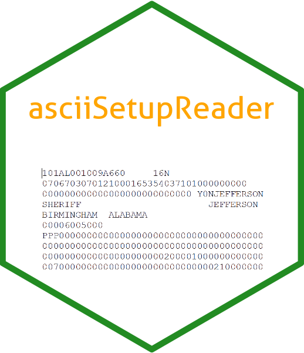

```{r, include = FALSE}
knitr::opts_chunk$set(
  collapse = TRUE,
  comment = "#>",
  fig.path = "man/figures/README-",
  out.width = "100%"
)
```

# asciiSetupReader 

<!-- badges: start -->
[](https://cran.r-project.org/package=asciiSetupReader)
[](https://ci.appveyor.com/project/jacobkap/asciiSetupReader)
[](https://app.codecov.io/github/jacobkap/asciiSetupReader?branch=master)
[](https://cran.r-project.org/package=asciiSetupReader)
[](https://lifecycle.r-lib.org/articles/stages.html)
<!-- badges: end -->

## Overview

Some (usually older) data sets are only available in fixed-width ASCII files (.txt or .dat) that have an .sps (SPSS) or .sas (SAS) setup file explaining to the software how to read that file. These file combinations are sometimes referred to as .txt+.sps, .txt+.sas, .dat+.sps, .dat+.sas. This package allows you to read in the data if you have both the fixed-width file and its accompanying setup file. 

## Installation

``` r
To install this package, use the code
install.packages("asciiSetupReader")


# The development version is available on Github.
# install.packages("devtools")
devtools::install_github("jacobkap/asciiSetupReader")
```

## Usage

The parameters `data` and `setup_file` are the only ones requires to run the package though three optional parameters allow you to customize results.

`data` - A string containing the name of the data file

`setup_file` - A string containing the name of the setup file

Both files must be in your working directory or the string must contain the path to the file. Below is an example of reading in the example dataset - the original data and setup files can be found [here](https://www.icpsr.umich.edu/icpsrweb/NACJD/studies/9327?q=&restrictionType%5B0%5D=Public+Use&classification%5B0%5D=NACJD.IX.*&dataFormat%5B0%5D=SPSS).

Please note that I am only using `system.file()` here so the vignette builds in the package even not on my own computer. You will not use this in the function. Instead you'd simply input `data = "example_data.zip"` and `setup_file = "example_setup.sps"`. The data file does not have to be in a zip folder, it is only in a zip folder here to reduce the size of this package. In most cases it will be a .dat or a .txt file.

```{r}
data <- system.file("extdata", "example_data.zip",
             package = "asciiSetupReader")
setup_file <- system.file("extdata", "example_setup.sps",
             package = "asciiSetupReader")

example <- asciiSetupReader::read_ascii_setup(data = data,
setup_file = setup_file)
example[1:6, 1:4] # Look at first 6 rows and first 4 columns
```
